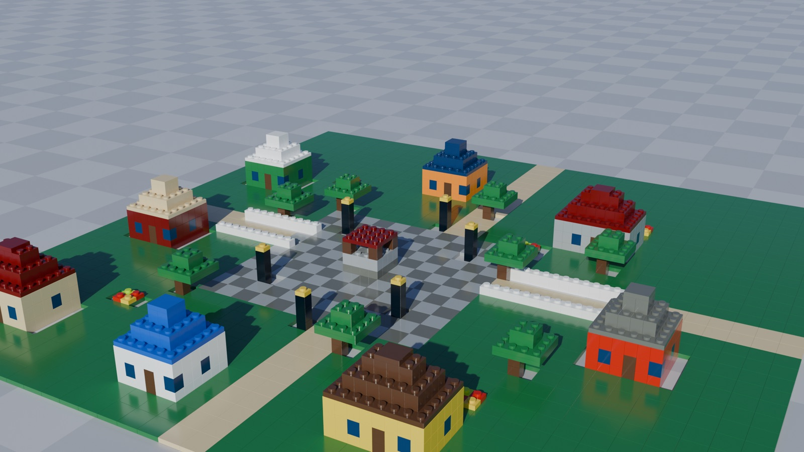
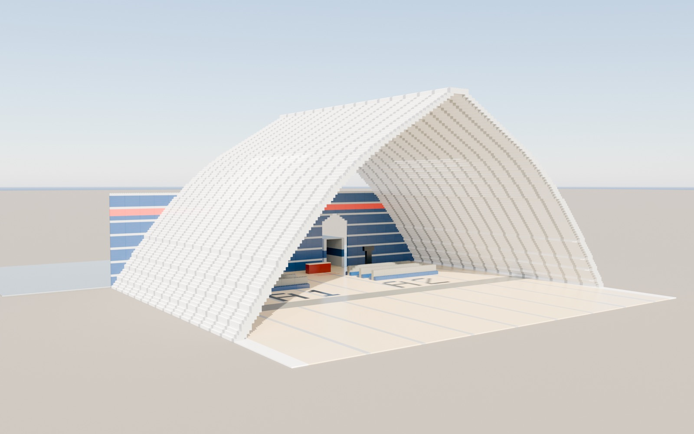
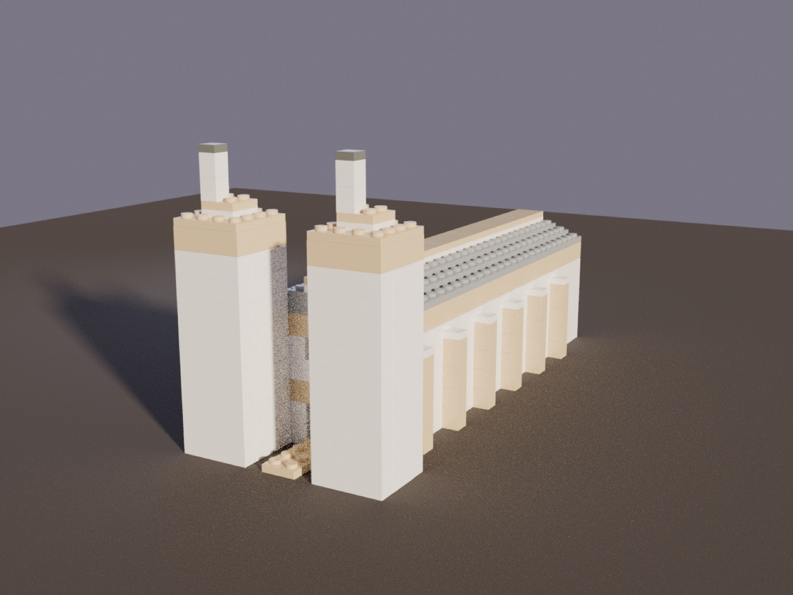

# lego-mcp

An MCP server where a model can only build **physically valid Lego**. Instead of
letting the model free-form geometry (and hallucinate impossible structures),
every action goes through a constraint engine that behaves like real plastic:

- **Catalog-only parts** — `brick_2x4`, `plate_1x6`, `tile_2x2`, slopes
  (`slope_2x2`, `slope_inv_1x2`, …), baseplates (`baseplate_32x32`, …).
  Unknown part names are rejected with suggestions. No hallucinated 3×5 bricks.
- **Solid bricks** — placements that overlap existing pieces are rejected, with
  the exact colliding cells and the lowest free z reported back.
- **Stud-to-tube connection required** — a piece must sit on studs of an
  existing piece, on the baseplate, or press its own studs up under an
  overhang. Floating bricks are rejected with a valid z suggested.
- **Tiles are smooth** — nothing can stack on a tile.
- **Slopes are directional** — studs only on their non-sloped rows (nothing
  attaches to the sloped face); rotation is 0/90/180/270 and slopes descend
  toward +y at rotation 0. Inverted slopes grip below only on their tall rows.
- **Baseplates are ground-only** — studs on top, smooth underneath, z=0 only.
- **No orphaning** — removing a piece that would leave others disconnected
  from the baseplate is refused ("remove those first, top down").
- **Stability hints** — extreme cantilevers succeed but return a warning.

The error messages are written *for the model*: each rejection explains the
violated constraint and suggests a fix, so an agent converges on buildable
structures instead of drifting.

## Built by a model, through the constraints

Every piece below was placed by an LLM whose *only* tools were this server's —
each brick validated stud-by-stud, then exported to Blender and rendered. No
piece floats, overlaps, or stacks on a tile.



| Corbelled arch | Colonnade |
|---|---|
|  |  |

The corbelled arch is the constraint engine at its most demanding: every course
steps inward off the studs of the one below, and the two flanks have to meet at
the crown without a single floating brick — the model gets there because each
illegal step is bounced back with the reason and a legal alternative.

## Coordinates

- `x`, `y` in studs, `z` in **plates** (1 brick = 3 plates tall).
- `z=0` is the baseplate; a brick on top of a brick placed at `z=0` goes at `z=3`.
- `rotation` is 0 or 90 (swaps the footprint).

## Tools

| Tool | Purpose |
|---|---|
| `new_build(name, width, depth)` | fresh baseplate |
| `list_parts()` | full catalog + colors |
| `place_brick(part, x, y, z, rotation, color)` | validated placement |
| `remove_brick(piece_id)` | validated removal |
| `get_build()` | full state as JSON |
| `view_layers(z_from, z_to)` | top-down ASCII map per plate layer |
| `load_build(name)` | reload a saved build (re-validated on load) |
| `export_build(fmt)` | `ldraw` → `.ldr` (BrickLink Studio / LeoCAD), `blender` → `bpy` script |

State auto-saves to `<state>/<name>.json` after every mutation and the latest
build is resumed on server restart. The state directory is, in order:
`$LEGO_MCP_HOME/builds` if set, else the repo's `builds/` when run from a
writable checkout, else `~/.lego-mcp/builds` when installed. Set
`LEGO_MCP_HOME` to keep builds wherever you like.

## Install

`lego-mcp` is a standard [stdio MCP server](https://modelcontextprotocol.io),
so any MCP-capable host can run it. It's packaged as a normal Python
distribution — the only thing a host needs is a command that launches it.

### Run it with no install (recommended)

[`uvx`](https://docs.astral.sh/uv/) fetches and runs it in a throwaway
environment, so there's nothing to maintain:

```bash
uvx --from "git+https://github.com/Axel-Jalonen/lego-mcp" lego-mcp   # straight from this repo
uvx --from ./dist/lego_mcp-0.1.0-py3-none-any.whl lego-mcp           # from a built wheel
```

### Or install it as a tool

```bash
pipx install "git+https://github.com/Axel-Jalonen/lego-mcp"   # or: pip install ...
lego-mcp                     # the `lego-mcp` command is now on PATH
```

Or grab the prebuilt wheel from the [latest
release](https://github.com/Axel-Jalonen/lego-mcp/releases/latest) and
`pipx install lego_mcp-0.1.0-py3-none-any.whl`.

### Build the distributable yourself

```bash
uv build          # -> dist/lego_mcp-0.1.0-py3-none-any.whl  (+ .tar.gz)
```

The `.whl` is the portable artifact: copy it anywhere, `uvx --from
<the.whl> lego-mcp`, done. No source checkout, venv, or absolute paths needed.

### Wiring it into a host

Every MCP host takes the same shape — a command + args. Use `uvx` so the host
doesn't need Python set up:

```jsonc
{
  "mcpServers": {
    "lego": {
      "command": "uvx",
      "args": ["--from", "git+https://github.com/Axel-Jalonen/lego-mcp", "lego-mcp"],
      "env": { "LEGO_MCP_HOME": "~/lego-builds" }
    }
  }
}
```

- **Claude Desktop** → `claude_desktop_config.json` (Settings → Developer).
- **Claude Code** → `claude mcp add lego -- uvx --from git+https://github.com/Axel-Jalonen/lego-mcp lego-mcp`
  (this repo also ships a dev [.mcp.json](.mcp.json)).
- **Cursor / Windsurf / VS Code MCP** → the same `mcpServers` block.
- **Ollama** → Ollama's own runtime doesn't load MCP servers directly; run it
  through an MCP host that talks to Ollama, e.g.
  [`mcphost`](https://github.com/mark3labs/mcphost) or Open WebUI. `mcphost`
  reads the identical config above, so pointing it at the same `uvx` command
  gives your local model the eight Lego tools.

## Development

```bash
python3 -m venv .venv
.venv/bin/pip install -e . pytest          # editable install
.venv/bin/python -m pytest tests/          # 15 constraint tests
```

## Pointing a small model at it

[agent/build_agent.py](agent/build_agent.py) runs an agent loop where a model's
**only** tools are this server's — no filesystem, no bash, no repo access. The
constraint engine rejects every invalid move with a corrective hint, so even a
small model can only ever produce physically valid builds:

```bash
export ANTHROPIC_API_KEY=sk-ant-...
.venv/bin/python agent/build_agent.py "build a small watchtower"
.venv/bin/python agent/build_agent.py --model claude-sonnet-5 "build a bridge"
```

Defaults to `claude-haiku-4-5`. The final state is reported by the engine
(`get_build`), not by the model's own claims, and builds land in `builds/`.

## Layout

- [lego_mcp/catalog.py](lego_mcp/catalog.py) — part definitions (footprint,
  height in plates, stud availability, LDraw ids) and colors
- [lego_mcp/engine.py](lego_mcp/engine.py) — occupancy grid, connection rules,
  orphan detection, ASCII views, save/load
- [lego_mcp/export.py](lego_mcp/export.py) — LDraw + Blender exporters
- [lego_mcp/server.py](lego_mcp/server.py) — FastMCP tool layer
